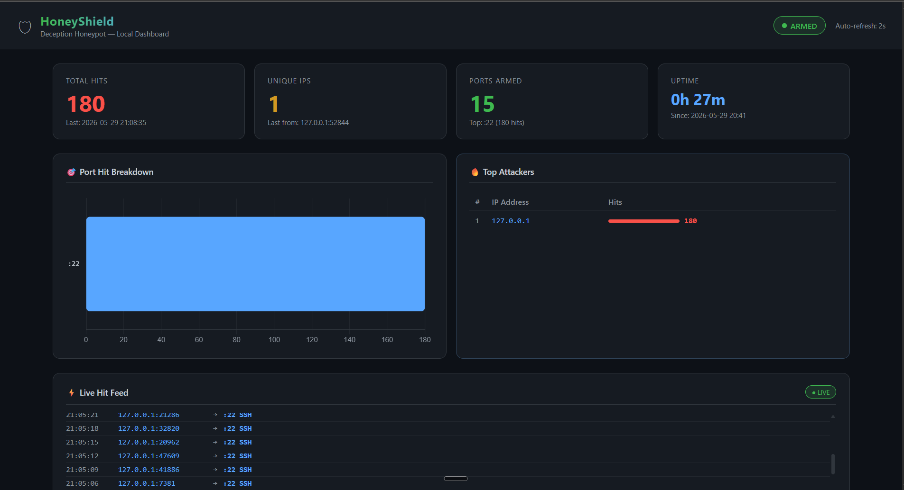

# 🛡 HoneyShield

A multi-port deception honeypot I built for my Windows machine after getting tired of not knowing who was probing my network. It listens on 16 commonly attacked ports, captures everything attackers send (including credentials they try), looks up where they're from, and auto-blocks the persistent ones — all with a live web dashboard to watch it unfold in real time.



---

## Why I built this

I was doing a security audit on my own PC and realized I had no visibility into who was scanning me. Windows Firewall blocks things silently — you never see what's actually hitting you. I wanted something that would let me *watch* attackers in real time, capture what tools and credentials they're using, and actually do something about the ones that won't give up.

So I built HoneyShield. It's been running on my machine 24/7 and the data it collects is genuinely interesting — automated bots hit common ports within hours of any IP being exposed.

---

## What it does

**16 fake services** listen on the most attacked ports. Each one sends a realistic banner so automated scanners think they found a real target and keep going, revealing more about their tools and intentions.

| Port | Fake Service | What it catches |
|------|-------------|-----------------|
| 21 | FTP | Credential stuffing bots |
| 22 | SSH | Brute force tools, leaked key attempts |
| 23 | Telnet | IoT botnet scanners |
| 25 | SMTP | Spam relay abusers |
| 80 | HTTP admin panel | Credential harvesting — captures real passwords tried |
| 110 | POP3 | Email scanners |
| 143 | IMAP | Email credential theft |
| 1433 | MSSQL | Database attack tools |
| 3306 | MySQL | SQLi scanners, credential attacks |
| 3389 | RDP | Ransomware entry attempts |
| 5900 | VNC | Remote desktop takeover |
| 6379 | Redis | Crypto mining bots |
| 8080 | HTTP Alt | Admin panel hunters |
| 9200 | Elasticsearch | Data-stealing bots |
| 27017 | MongoDB | Ransomware targeting open databases |
| 8443 | HTTPS Alt | Web app scanners |

**Port 80 is the crown jewel.** It serves a convincing fake NAS admin login page. When a bot or attacker submits a login form, the credentials they tried get captured and logged — you actually see the real passwords circulating in credential stuffing lists.

---

## Features

- **Live web dashboard** — auto-refreshes every 3 seconds, no page reload
- **Geo-IP enrichment** — every hit gets country, city, ISP, and VPN/proxy detection
- **Credential capture** — username/password pairs from HTTP login attempts
- **Auto-blocking** — any IP that hits 15+ times in 10 minutes gets a Windows Firewall rule added automatically
- **Windows Event Log monitoring** — watches the real system for suspicious activity (failed logins, new services, privilege escalation, audit log cleared)
- **Canary files** — fake sensitive files (passwords.txt, SSH keys, DB backups) with Windows file auditing — if anything touches them, it means someone's already inside
- **Persistent logging** — everything written to disk in both human-readable and JSON formats
- **Auto-start** — registered as a Windows Task Scheduler job running as SYSTEM, restarts itself on crash
- **Toast notifications** — Windows pop-up when a new IP hits for the first time

---

## Dashboard

Six tabs covering everything:

- **Overview** — port breakdown chart, hourly hit timeline, top countries, recent system alerts
- **Live Feed** — every connection as it happens with country flag and captured data
- **Attackers** — top IPs ranked by hit count with geo info
- **Credentials** — table of every username/password submitted to the fake login
- **System Events** — suspicious Windows security events (4625, 7045, 4698, etc.)
- **Blocked IPs** — log of every IP that got auto-firewalled

---

## Tech stack

- **Python 3.13** — core honeypot and dashboard, no external dependencies
- **socket + threading** — handles concurrent connections across all 16 ports
- **http.server** — built-in HTTP server for the dashboard (no Flask needed)
- **Chart.js** — port breakdown and timeline charts
- **Windows Task Scheduler** — service management and auto-restart
- **Windows Firewall (netsh)** — auto-blocking
- **PowerShell / Get-WinEvent** — Windows Event Log monitoring
- **ip-api.com** — free geo-IP lookups (no API key required)

---

## Setup

**Requirements:** Python 3.x on Windows. No pip installs needed — everything uses the standard library.

```bash
git clone https://github.com/blackrose007/HoneyShield.git
cd HoneyShield
```

**Start the honeypot:**
```bash
python honeypot.py
```

**Open the dashboard** (in a separate terminal):
```bash
python dashboard.py
# Browser opens automatically at http://localhost:7777
```

**Watch the Windows Event Log** (optional, run as admin for full access):
```bash
python winevent_monitor.py
```

**Terminal-based quick view:**
```bash
python view_alerts.py          # summary + last 30 hits
python view_alerts.py --live   # live tail
python view_alerts.py --json   # deep analysis
```

### Auto-start on boot (Windows)

Register as a SYSTEM-level scheduled task so it starts at boot and restarts on crash:

```powershell
# Run as Administrator
$action = New-ScheduledTaskAction -Execute "python.exe" -Argument "C:\HoneyShield\honeypot.py" -WorkingDirectory "C:\HoneyShield"
$trigger = New-ScheduledTaskTrigger -AtStartup
$settings = New-ScheduledTaskSettingsSet -ExecutionTimeLimit (New-TimeSpan -Days 0) -RestartCount 10 -RestartInterval (New-TimeSpan -Minutes 1)
$principal = New-ScheduledTaskPrincipal -UserId "SYSTEM" -LogonType ServiceAccount -RunLevel Highest
Register-ScheduledTask -TaskName "HoneyShield" -Action $action -Trigger $trigger -Settings $settings -Principal $principal -Force
```

---

## Log files

| File | Contents |
|------|----------|
| `logs/honeypot.log` | Human-readable hit log |
| `logs/events.jsonl` | Structured JSON — one event per line |
| `logs/credentials.log` | Captured usernames and passwords |
| `logs/winevent.log` | Windows security events |
| `alerts/summary.json` | Live stats (totals, top IPs, port breakdown) |
| `alerts/blocked_ips.txt` | Auto-blocked IP log |

---

## Canary files

`canary/` contains fake sensitive files — fake passwords, SSH keys, database dumps — with Windows file system auditing (SACL) enabled. Any read access fires **Event ID 4663** in the Windows Security log. This catches a different threat than the network honeypot: an attacker who's already inside and rummaging through files.

---

## Legal note

This is a passive defensive tool. It listens on ports, logs what it receives, and blocks persistent attackers via the Windows Firewall. It does not attempt to access, damage, or take any action against external systems. Run it on hardware you own.

---

## What I learned

Building this taught me a lot more than I expected — writing realistic protocol banners that fool real scanners, handling concurrent socket connections cleanly, integrating with Windows internals (Task Scheduler, Firewall, Event Log, SACLs), and building a live-updating dashboard without any framework. The data it collects is also just genuinely interesting — seeing what credentials bots try and where they come from makes the threat landscape feel very real.

---

*Built and running on my own Windows 11 machine. If you find a bug or want to add a protocol, open an issue.*
